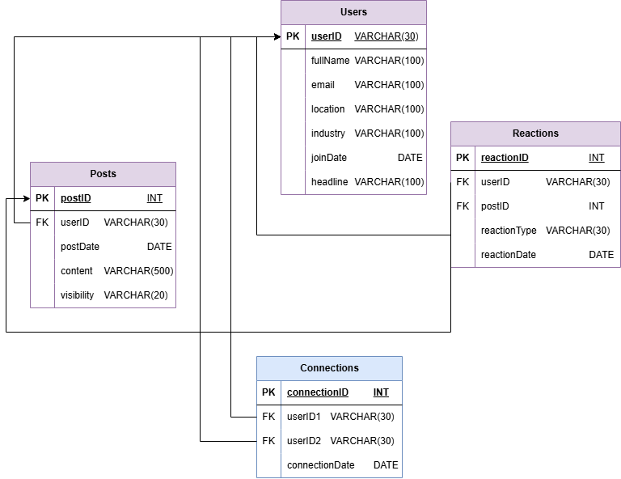

# Relational Database for a Professional Social Network

This project was developed as part of the **Data Engineering** course and focuses on the design and implementation of a relational database system inspired by professional social networks like LinkedIn.

The main objective was to create and transform a denormalized dataset—initially containing mixed user, post, and reaction data—into a well-structured, normalized relational database. The final model supports key relationships and constraints while ensuring data integrity and consistency.

Here the logical schema that outlines the detailed structure of the database tables, including all column names, data types, and relationships:

## Documentation
Detailed documentation of the design process, SQL code, and implementation decisions is available in the report file: _relational_db_report_.

